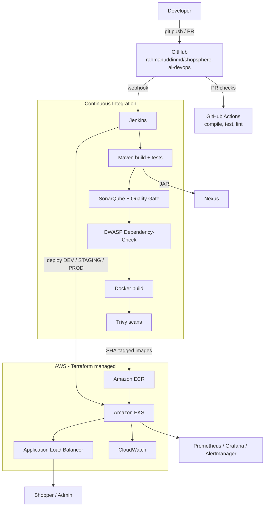

# 01 — Overall Architecture

```mermaid
flowchart TB
    DEV["Developer"] -->|"git push / PR"| GH["GitHub<br/>rahmanuddinmd/shopsphere-ai-devops"]
    GH -->|"PR checks"| GHA["GitHub Actions<br/>compile, test, lint"]
    GH -->|"webhook"| JK["Jenkins"]

    subgraph CI["Continuous Integration"]
        JK --> MVN["Maven build + tests"]
        MVN --> SQ["SonarQube + Quality Gate"]
        SQ --> OW["OWASP Dependency-Check"]
        OW --> DB["Docker build"]
        DB --> TV["Trivy scans"]
    end

    MVN -->|"JAR"| NX["Nexus"]
    TV -->|"SHA-tagged images"| ECR["Amazon ECR"]

    subgraph AWS["AWS - Terraform managed"]
        ECR --> EKS["Amazon EKS"]
        EKS --> ALB["Application Load Balancer"]
        EKS --> CW["CloudWatch"]
    end

    JK -->|"deploy DEV / STAGING / PROD"| EKS
    ALB --> USER["Shopper / Admin"]
    EKS --> PROM["Prometheus / Grafana / Alertmanager"]
```
