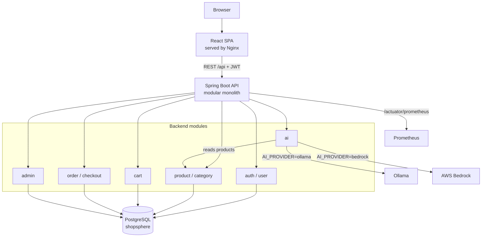

# 02 — Application Architecture

```mermaid
flowchart TB
    BR["Browser"] --> FE["React SPA<br/>served by Nginx"]
    FE -->|"REST /api + JWT"| API["Spring Boot API<br/>modular monolith"]

    subgraph API_MODULES["Backend modules"]
        AUTH["auth / user"]
        PROD["product / category"]
        CART["cart"]
        ORD["order / checkout"]
        ADM["admin"]
        AI["ai"]
    end

    API --> AUTH & PROD & CART & ORD & ADM & AI
    AUTH & PROD & CART & ORD & ADM --> PG[("PostgreSQL<br/>shopsphere")]
    AI -->|"reads products"| PROD
    AI -->|"AI_PROVIDER=ollama"| OL["Ollama"]
    AI -->|"AI_PROVIDER=bedrock"| BED["AWS Bedrock"]
    API -->|"/actuator/prometheus"| PM["Prometheus"]
```
