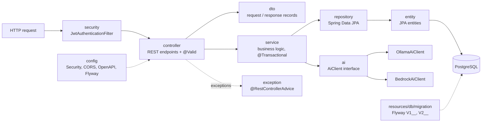

# 03 — Backend Architecture (Spring Boot, package com.shopsphere)

```mermaid
flowchart LR
    REQ["HTTP request"] --> FIL["security<br/>JwtAuthenticationFilter"]
    FIL --> CTRL["controller<br/>REST endpoints + @Valid"]
    CTRL --> DTO["dto<br/>request / response records"]
    CTRL --> SVC["service<br/>business logic, @Transactional"]
    SVC --> REPO["repository<br/>Spring Data JPA"]
    REPO --> ENT["entity<br/>JPA entities"]
    ENT --> DB[("PostgreSQL")]
    SVC --> AIP["ai<br/>AiClient interface"]
    AIP --> OLC["OllamaAiClient"]
    AIP --> BRC["BedrockAiClient"]
    CTRL -.->|"exceptions"| EXH["exception<br/>@RestControllerAdvice"]
    CFG["config<br/>Security, CORS, OpenAPI, Flyway"] -.-> CTRL
    MIG["resources/db/migration<br/>Flyway V1__, V2__"] -.-> DB
```

Layering rule: controllers never call repositories directly; entities never leave the
service layer (DTOs are returned instead).
