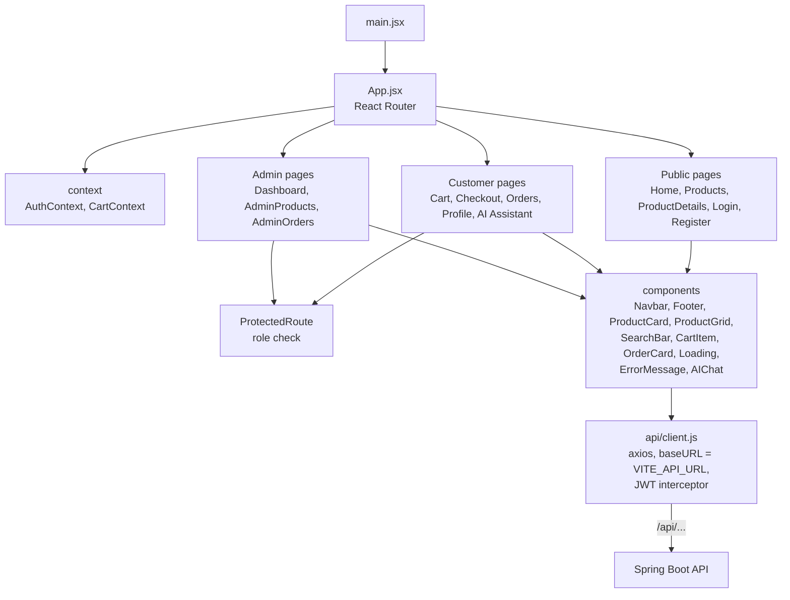

# 04 — Frontend Architecture (React + Vite)

```mermaid
flowchart TB
    MAIN["main.jsx"] --> APP["App.jsx<br/>React Router"]
    APP --> CTX["context<br/>AuthContext, CartContext"]
    APP --> PUB["Public pages<br/>Home, Products, ProductDetails, Login, Register"]
    APP --> CUS["Customer pages<br/>Cart, Checkout, Orders, Profile, AI Assistant"]
    APP --> ADM["Admin pages<br/>Dashboard, AdminProducts, AdminOrders"]
    CUS & ADM --> GUARD["ProtectedRoute<br/>role check"]
    PUB & CUS & ADM --> COMP["components<br/>Navbar, Footer, ProductCard, ProductGrid,<br/>SearchBar, CartItem, OrderCard, Loading,<br/>ErrorMessage, AIChat"]
    COMP --> APIC["api/client.js<br/>axios, baseURL = VITE_API_URL,<br/>JWT interceptor"]
    APIC -->|"/api/..."| BE["Spring Boot API"]
```
