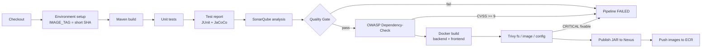

# 08 — CI Pipeline (Jenkinsfile)

```mermaid
flowchart LR
    A["Checkout"] --> B["Environment setup<br/>IMAGE_TAG = short SHA"]
    B --> C["Maven build"]
    C --> D["Unit tests"]
    D --> E["Test report<br/>JUnit + JaCoCo"]
    E --> F["SonarQube analysis"]
    F --> G{"Quality Gate"}
    G -->|"fail"| X["Pipeline FAILED"]
    G -->|"pass"| H["OWASP Dependency-Check"]
    H -->|"CVSS >= 9"| X
    H --> I["Docker build<br/>backend + frontend"]
    I --> J["Trivy fs / image / config"]
    J -->|"CRITICAL fixable"| X
    J --> K["Publish JAR to Nexus"]
    K --> L["Push images to ECR"]
```
