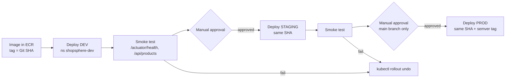

# 09 — CD Pipeline and Promotion

```mermaid
flowchart LR
    IMG["Image in ECR<br/>tag = Git SHA"] --> DEV["Deploy DEV<br/>ns shopsphere-dev"]
    DEV --> SMK1["Smoke test<br/>/actuator/health, /api/products"]
    SMK1 --> AP1{"Manual approval"}
    AP1 -->|"approved"| STG["Deploy STAGING<br/>same SHA"]
    STG --> SMK2["Smoke test"]
    SMK2 --> AP2{"Manual approval<br/>main branch only"}
    AP2 -->|"approved"| PRD["Deploy PROD<br/>same SHA + semver tag"]
    SMK1 -->|"fail"| RB["kubectl rollout undo"]
    SMK2 -->|"fail"| RB
```

Strategy: Kubernetes RollingUpdate (`maxUnavailable: 0`, `maxSurge: 1`). Blue/green is
discussed in the hardening phase.
