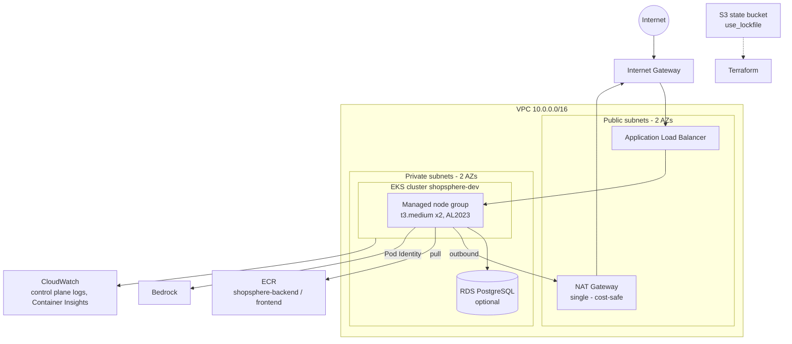

# 12 — AWS Architecture (ap-south-1, DEV)

```mermaid
flowchart TB
    INET(("Internet")) --> IGW["Internet Gateway"]
    subgraph VPC["VPC 10.0.0.0/16"]
        subgraph PUB["Public subnets - 2 AZs"]
            ALB["Application Load Balancer"]
            NAT["NAT Gateway<br/>single - cost-safe"]
        end
        subgraph PRIV["Private subnets - 2 AZs"]
            subgraph EKS["EKS cluster shopsphere-dev"]
                NG["Managed node group<br/>t3.medium x2, AL2023"]
            end
            RDS[("RDS PostgreSQL<br/>optional")]
        end
    end
    IGW --> ALB
    ALB --> NG
    NG --> RDS
    NG -->|"outbound"| NAT --> IGW
    NG -->|"pull"| ECR["ECR<br/>shopsphere-backend / frontend"]
    NG -->|"Pod Identity"| BED["Bedrock"]
    EKS --> CW["CloudWatch<br/>control plane logs, Container Insights"]
    S3["S3 state bucket<br/>use_lockfile"] -.-> TF["Terraform"]
```
