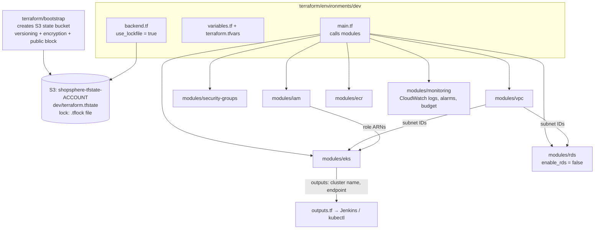

# 13 — Terraform Architecture

```mermaid
flowchart TB
    BOOT["terraform/bootstrap<br/>creates S3 state bucket<br/>versioning + encryption + public block"] --> S3[("S3: shopsphere-tfstate-ACCOUNT<br/>dev/terraform.tfstate<br/>lock: .tflock file")]
    subgraph ENV["terraform/environments/dev"]
        MAIN["main.tf<br/>calls modules"]
        VARS["variables.tf + terraform.tfvars"]
        BK["backend.tf<br/>use_lockfile = true"]
    end
    BK --> S3
    MAIN --> VPC["modules/vpc"]
    MAIN --> SG["modules/security-groups"]
    MAIN --> IAM["modules/iam"]
    MAIN --> ECR["modules/ecr"]
    MAIN --> EKS["modules/eks"]
    MAIN --> RDS["modules/rds<br/>enable_rds = false"]
    MAIN --> MON["modules/monitoring<br/>CloudWatch logs, alarms, budget"]
    VPC -->|"subnet IDs"| EKS
    VPC -->|"subnet IDs"| RDS
    IAM -->|"role ARNs"| EKS
    EKS -->|"outputs: cluster name, endpoint"| OUT["outputs.tf → Jenkins / kubectl"]
```
