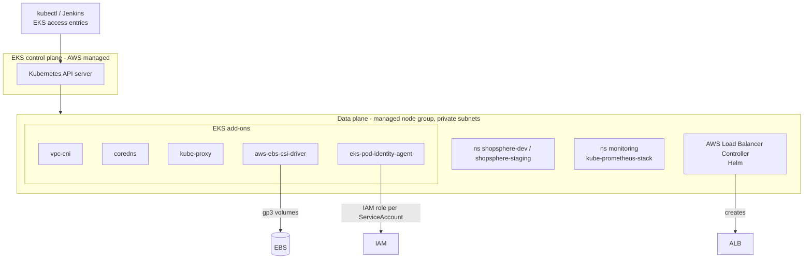

# 14 — EKS Architecture

```mermaid
flowchart TB
    subgraph CP["EKS control plane - AWS managed"]
        APIS["Kubernetes API server"]
    end
    subgraph DP["Data plane - managed node group, private subnets"]
        subgraph ADDONS["EKS add-ons"]
            CNI["vpc-cni"]
            DNS["coredns"]
            KP["kube-proxy"]
            EBS["aws-ebs-csi-driver"]
            PIA["eks-pod-identity-agent"]
        end
        LBC["AWS Load Balancer Controller<br/>Helm"]
        APPNS["ns shopsphere-dev / shopsphere-staging"]
        MONNS["ns monitoring<br/>kube-prometheus-stack"]
    end
    USR["kubectl / Jenkins<br/>EKS access entries"] --> APIS
    APIS --> DP
    LBC -->|"creates"| ALB["ALB"]
    PIA -->|"IAM role per ServiceAccount"| IAM["IAM"]
    EBS -->|"gp3 volumes"| VOL[("EBS")]
```

Access control uses **EKS access entries** (current API) rather than editing the legacy
`aws-auth` ConfigMap.
