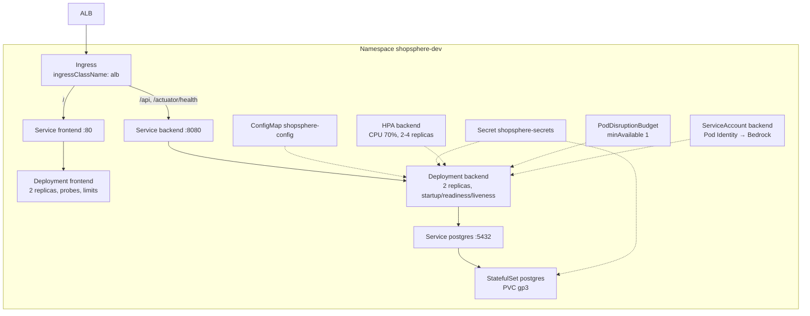

# 15 — Kubernetes Deployment Architecture

```mermaid
flowchart TB
    ALB["ALB"] --> ING["Ingress<br/>ingressClassName: alb"]
    subgraph NS["Namespace shopsphere-dev"]
        ING -->|"/"| FSVC["Service frontend :80"]
        ING -->|"/api, /actuator/health"| BSVC["Service backend :8080"]
        FSVC --> FD["Deployment frontend<br/>2 replicas, probes, limits"]
        BSVC --> BD["Deployment backend<br/>2 replicas, startup/readiness/liveness"]
        BD --> PSVC["Service postgres :5432"]
        PSVC --> PSS["StatefulSet postgres<br/>PVC gp3"]
        CM["ConfigMap shopsphere-config"] -.-> BD
        SEC["Secret shopsphere-secrets"] -.-> BD
        SEC -.-> PSS
        HPA["HPA backend<br/>CPU 70%, 2-4 replicas"] -.-> BD
        PDB["PodDisruptionBudget<br/>minAvailable 1"] -.-> BD
        SA["ServiceAccount backend<br/>Pod Identity → Bedrock"] -.-> BD
    end
```
