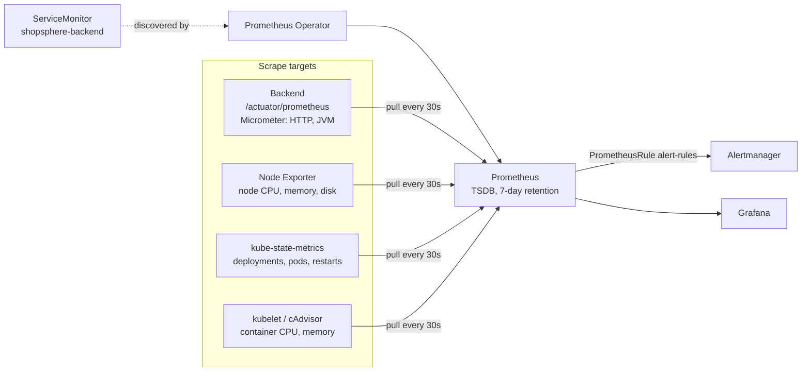

# 16 — Prometheus Architecture

```mermaid
flowchart LR
    subgraph TARGETS["Scrape targets"]
        APP["Backend<br/>/actuator/prometheus<br/>Micrometer: HTTP, JVM"]
        NE["Node Exporter<br/>node CPU, memory, disk"]
        KSM["kube-state-metrics<br/>deployments, pods, restarts"]
        KUB["kubelet / cAdvisor<br/>container CPU, memory"]
    end
    SM["ServiceMonitor<br/>shopsphere-backend"] -.->|"discovered by"| PO["Prometheus Operator"]
    PO --> PR["Prometheus<br/>TSDB, 7-day retention"]
    APP & NE & KSM & KUB -->|"pull every 30s"| PR
    PR -->|"PrometheusRule alert-rules"| AM["Alertmanager"]
    PR --> GR["Grafana"]
```
