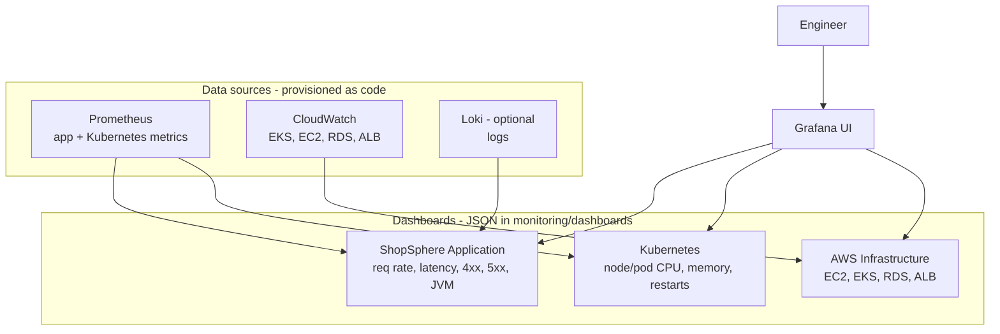

# 17 — Grafana Monitoring Architecture

```mermaid
flowchart TB
    subgraph DS["Data sources - provisioned as code"]
        P["Prometheus<br/>app + Kubernetes metrics"]
        C["CloudWatch<br/>EKS, EC2, RDS, ALB"]
        L["Loki - optional<br/>logs"]
    end
    subgraph DB["Dashboards - JSON in monitoring/dashboards"]
        D1["ShopSphere Application<br/>req rate, latency, 4xx, 5xx, JVM"]
        D2["Kubernetes<br/>node/pod CPU, memory, restarts"]
        D3["AWS Infrastructure<br/>EC2, EKS, RDS, ALB"]
    end
    P --> D1 & D2
    C --> D3
    L --> D1
    U["Engineer"] --> GR["Grafana UI"]
    GR --> D1 & D2 & D3
```
