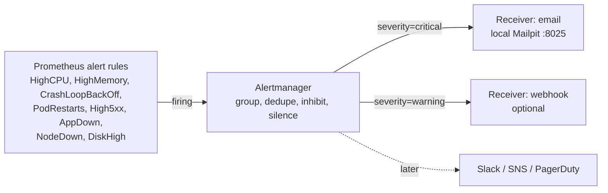

# 18 — Alertmanager Architecture

```mermaid
flowchart LR
    R["Prometheus alert rules<br/>HighCPU, HighMemory, CrashLoopBackOff,<br/>PodRestarts, High5xx, AppDown,<br/>NodeDown, DiskHigh"] -->|"firing"| AM["Alertmanager<br/>group, dedupe, inhibit, silence"]
    AM -->|"severity=critical"| R1["Receiver: email<br/>local Mailpit :8025"]
    AM -->|"severity=warning"| R2["Receiver: webhook<br/>optional"]
    AM -.->|"later"| R3["Slack / SNS / PagerDuty"]
```

Local testing uses Mailpit (a free SMTP catcher) — no paid notification service required.
