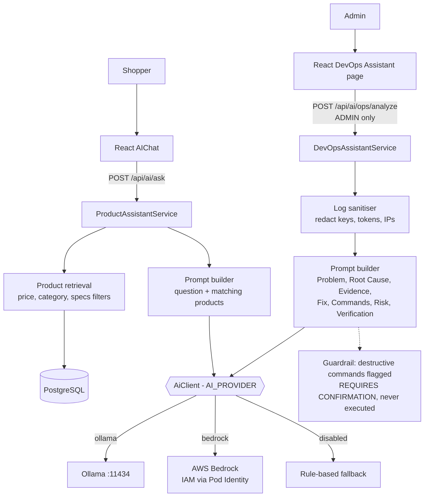

# 19 — AI Architecture

```mermaid
flowchart TB
    U["Shopper"] --> CHAT["React AIChat"]
    A["Admin"] --> OPS["React DevOps Assistant page"]
    CHAT -->|"POST /api/ai/ask"| PA["ProductAssistantService"]
    OPS -->|"POST /api/ai/ops/analyze<br/>ADMIN only"| OA["DevOpsAssistantService"]
    PA --> RET["Product retrieval<br/>price, category, specs filters"]
    RET --> DB[("PostgreSQL")]
    PA --> PB["Prompt builder<br/>question + matching products"]
    OA --> RED["Log sanitiser<br/>redact keys, tokens, IPs"]
    RED --> PB2["Prompt builder<br/>Problem, Root Cause, Evidence,<br/>Fix, Commands, Risk, Verification"]
    PB & PB2 --> IF{{"AiClient - AI_PROVIDER"}}
    IF -->|"ollama"| OL["Ollama :11434"]
    IF -->|"bedrock"| BR["AWS Bedrock<br/>IAM via Pod Identity"]
    IF -->|"disabled"| FB["Rule-based fallback"]
    PB2 -.-> GUARD["Guardrail: destructive commands flagged<br/>REQUIRES CONFIRMATION, never executed"]
```
