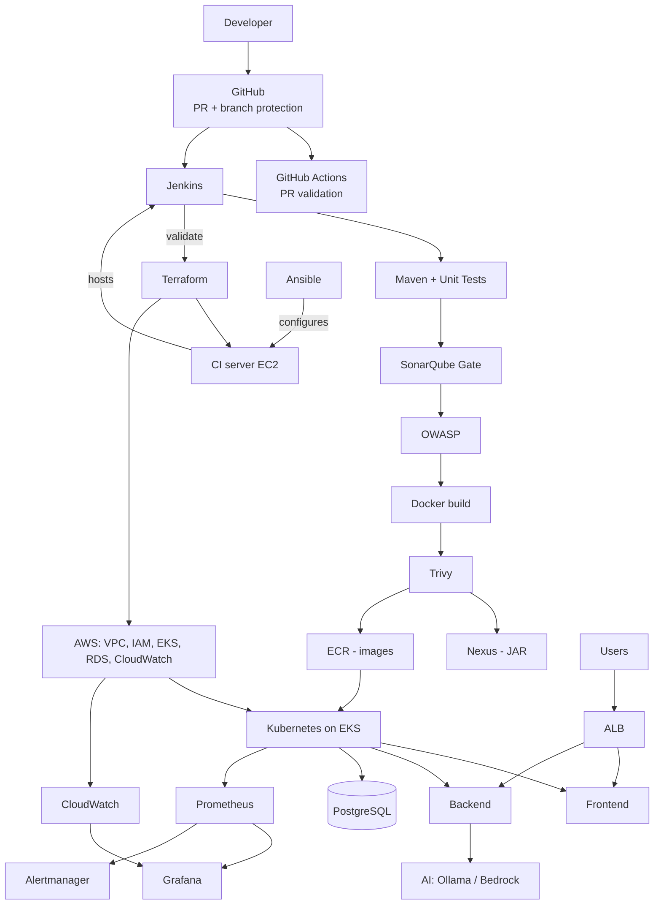

# 20 — Complete End-to-End Architecture

```mermaid
flowchart TB
    DEV["Developer"] --> GH["GitHub<br/>PR + branch protection"]
    GH --> GHA["GitHub Actions<br/>PR validation"]
    GH --> JK["Jenkins"]
    JK --> MVN["Maven + Unit Tests"]
    MVN --> SQ["SonarQube Gate"]
    SQ --> OW["OWASP"]
    OW --> DK["Docker build"]
    DK --> TV["Trivy"]
    TV --> NX["Nexus - JAR"]
    TV --> ECR["ECR - images"]
    TF["Terraform"] --> CIVM["CI server EC2"]
    AN["Ansible"] -->|"configures"| CIVM
    CIVM -->|"hosts"| JK
    JK -->|"validate"| TF
    TF --> AWS["AWS: VPC, IAM, EKS, RDS, CloudWatch"]
    ECR --> K8S["Kubernetes on EKS"]
    AWS --> K8S
    K8S --> FE["Frontend"]
    K8S --> BE["Backend"]
    K8S --> PG[("PostgreSQL")]
    BE --> AI["AI: Ollama / Bedrock"]
    ALB["ALB"] --> FE
    ALB --> BE
    USER["Users"] --> ALB
    K8S --> PROM["Prometheus"]
    PROM --> GRAF["Grafana"]
    PROM --> AM["Alertmanager"]
    AWS --> CW["CloudWatch"]
    CW --> GRAF
```
