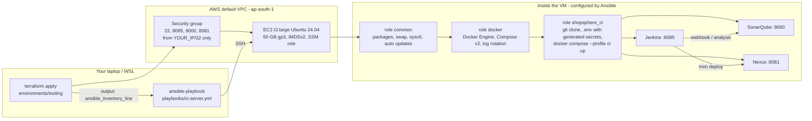

# 21 — CI Server Provisioning (Terraform + Ansible)

Terraform **creates** infrastructure; Ansible **configures** what runs on it.

```mermaid
flowchart LR
    subgraph LAPTOP["Your laptop / WSL"]
        TF["terraform apply<br/>environments/tooling"]
        AN["ansible-playbook<br/>playbooks/ci-server.yml"]
    end
    subgraph AWS["AWS default VPC - ap-south-1"]
        SG["Security group<br/>22, 8085, 9000, 8081<br/>from YOUR_IP/32 only"]
        EC2["EC2 t3.large Ubuntu 24.04<br/>50 GB gp3, IMDSv2, SSM role"]
    end
    subgraph VM["Inside the VM - configured by Ansible"]
        R1["role common<br/>packages, swap, sysctl, auto updates"]
        R2["role docker<br/>Docker Engine, Compose v2, log rotation"]
        R3["role shopsphere_ci<br/>git clone, .env with generated secrets,<br/>docker compose --profile ci up"]
        JK["Jenkins :8085"]
        SQ["SonarQube :9000"]
        NX["Nexus :8081"]
    end
    TF --> SG --> EC2
    TF -->|"output: ansible_inventory_line"| AN
    AN -->|"SSH"| EC2
    EC2 --> R1 --> R2 --> R3
    R3 --> JK & SQ & NX
    JK -->|"webhook / analysis"| SQ
    JK -->|"mvn deploy"| NX
```
