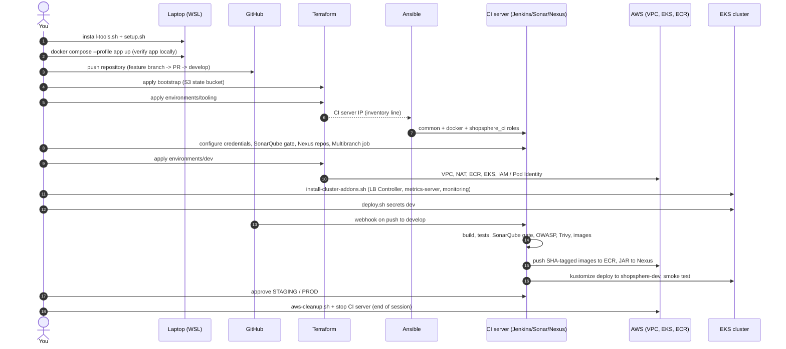

# 22 — End-to-End Deployment Sequence

The order of `docs/DEPLOYMENT_RUNBOOK.md`.

```mermaid
sequenceDiagram
    autonumber
    actor Dev as You
    participant Local as Laptop (WSL)
    participant GH as GitHub
    participant TF as Terraform
    participant AN as Ansible
    participant CI as CI server (Jenkins/Sonar/Nexus)
    participant AWS as AWS (VPC, EKS, ECR)
    participant K8s as EKS cluster

    Dev->>Local: install-tools.sh + setup.sh
    Dev->>Local: docker compose --profile app up (verify app locally)
    Dev->>GH: push repository (feature branch -> PR -> develop)
    Dev->>TF: apply bootstrap (S3 state bucket)
    Dev->>TF: apply environments/tooling
    TF-->>AN: CI server IP (inventory line)
    AN->>CI: common + docker + shopsphere_ci roles
    Dev->>CI: configure credentials, SonarQube gate, Nexus repos, Multibranch job
    Dev->>TF: apply environments/dev
    TF->>AWS: VPC, NAT, ECR, EKS, IAM / Pod Identity
    Dev->>K8s: install-cluster-addons.sh (LB Controller, metrics-server, monitoring)
    Dev->>K8s: deploy.sh secrets dev
    GH->>CI: webhook on push to develop
    CI->>CI: build, tests, SonarQube gate, OWASP, Trivy, images
    CI->>AWS: push SHA-tagged images to ECR, JAR to Nexus
    CI->>K8s: kustomize deploy to shopsphere-dev, smoke test
    Dev->>CI: approve STAGING / PROD
    Dev->>AWS: aws-cleanup.sh + stop CI server (end of session)
```
